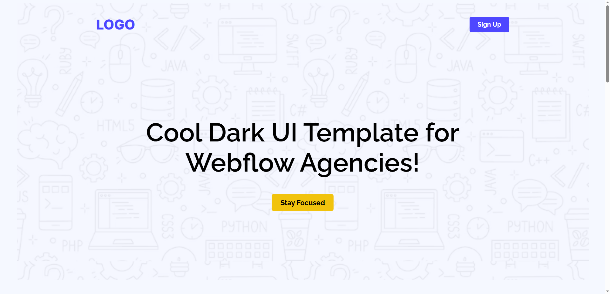

# 🚀 Cool Dark UI Template for Webflow Agencies

A modern, professional, dark-themed landing page template designed for Webflow agencies and digital creatives. This project features a bold, clean UI with a focus on usability, conversion, and showcasing your agency or SaaS offering.


Desktop View:


## 🚀 Live Demo

[View on GitHub Pages](https://shariar-ahamed.github.io/B12A01_landing_launchpad/)

---

## ✨ Features

- **Modern Dark UI:** Sleek and stylish design, perfect for creative agencies and SaaS products.
- **Conversion Focused:** Prominent CTAs like "Sign Up," "Stay Focused," and "Launch Live Preview" to drive user engagement.
- **User Trust Elements:** Social proof with stats (Active Users, Focus Sessions, Satisfaction Rate) and testimonial cards.
- **Responsive Layout:** Optimized for all devices for a seamless user experience.
- **Contact Form:** Easy-to-use form to help users get in touch.
- **Clean Code & Customization:** Well-organized codebase for easy customization and integration.

---

## 📦 Project Structure

```
B12A01_landing_launchpad/
├── assets/
│   └── images/
├── css/
│   └── styles.css
├── index.html
└── README.md
```

---

## 🖥️ Sections Overview

1. **Hero Section**  
   - Eye-catching headline and subheading
   - Main CTA button ("Stay Focused")
   - "Sign Up" button in header

2. **Live Preview**  
   - "See It in Action" section with a preview image and "Launch Live Preview" button

3. **Social Proof & Stats**  
   - User statistics for credibility

4. **Testimonials**  
   - User reviews to build trust

5. **Call to Action**  
   - Promotional banner with a CTA ("Get Started Free")

6. **Contact Section**  
   - Simple form for direct communication

7. **Footer**  
   - Logo branding and navigation links

---

## 🛠️ Getting Started

1. **Clone the repository:**
   ```bash
   git clone https://github.com/shariar-ahamed/B12A01_landing_launchpad.git
   cd B12A01_landing_launchpad
   ```

2. **Open index.html in your browser**  
   No build process required—just open the HTML file or deploy to your preferred static site host.

---

## ⚙️ Customization

- Replace the `LOGO` text with your agency or product logo.
- Update CTAs, testimonials, and stats to reflect your brand.
- Modify colors and fonts in `/css/styles.css` to match your style.

---

## 🤝 Contributing

Pull requests are welcome. For major changes, please open an issue first to discuss what you would like to change.

---

## 📄 License

This project is open source and available under the [MIT License](LICENSE).

---

## 🙏 Acknowledgements

- Inspired by modern SaaS and Webflow agency landing pages.
- Design and development by [shariar-ahamed](https://github.com/shariar-ahamed).

---

> Ready to elevate your online presence? [Check out the live demo!](https://shariar-ahamed.github.io/B12A01_landing_launchpad/)
